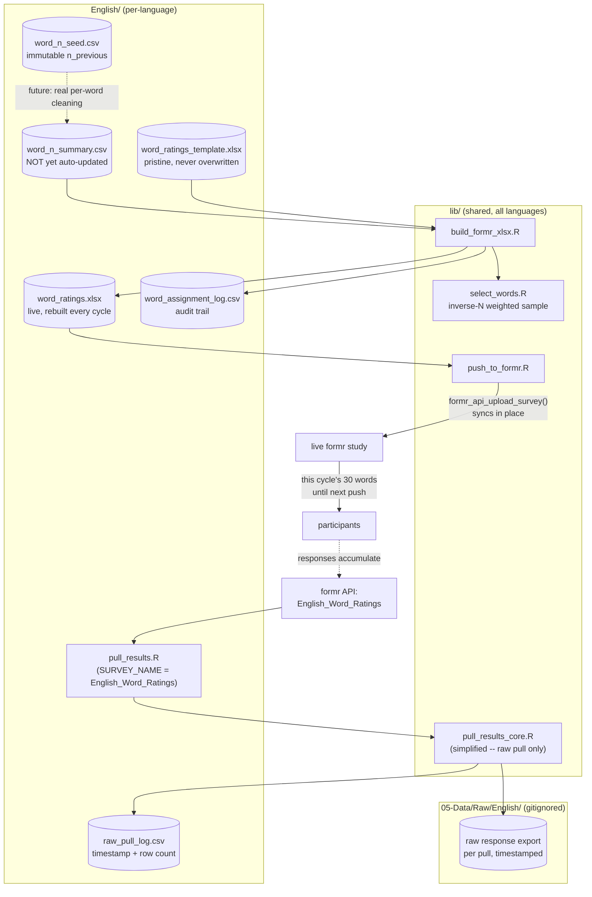

# English Task: Dynamic Word Selection Demo

Working demo of the pipeline that picks the cue words shown in the English
formr study, prioritizing undersampled cues, per the Stage 1 manuscript's
design: **30 randomly selected nouns per participant**, with undersampled
cues prioritized, cutoff at **30 responses per cue**. The survey now has
30 word-blocks (`w01`..`w30`), matching that.

Real formr identifiers: run **`manyuses-english`**, survey/item-table
**`English_Word_Ratings`** (the latter is what `pull_results.R` actually
pulls from — formr's API takes a survey name, not a run name; the run name
is recorded for documentation only).

**This folder holds only what's genuinely English-specific** — data files
and two thin wrapper scripts. The actual pipeline logic (selection, xlsx
rebuilding, pushing to formr) is shared across every language and lives in
`../lib/`; see `../README.md` for the full shared/per-language split and
the checklist for adding another language.

**Randomization is batch-level, not per-participant, and happens
server-side at build time — not inside formr.** A formr session can't
reliably reach out and rewrite itself mid-study, so instead of embedding a
word pool and sampling live per session, the server picks the 30 words
once per rebuild and bakes them as literal text straight into the survey.
Every participant who takes the survey between one push and the next sees
that same 30-word set; the next rebuild picks a fresh one. Because the
words are literal text, "which words were shown" is never ambiguous — it's
whatever's in the xlsx (and logged in `word_assignment_log.csv`) at that
time.

**Word-count updates are simplified for now, not real yet.**
`pull_results.R` pulls the raw formr results and logs the row count, but
does **not** update `word_n_summary.csv`. Turning a raw response row into
"cue X got one more response" requires joining it against
`word_assignment_log.csv` by timestamp (since the word in any given slot
changes every rebuild cycle) — that per-word cleaning isn't built yet.
Until it is, `word_n_summary.csv` stays static and each rebuild keeps
weight-sampling from whatever it was last set to.

## Pipeline

Not called directly by cron — see `../run_all_languages.sh`, the actual
dispatcher, which runs `../lib/run_update_and_push.sh English` (and every
other active language) on a schedule, skipping any language marked `done`
in `../languages_status.csv`.

## Coverage-speed trade-off

Batch-level randomization means coverage speed = (words refreshed per
cycle) ÷ (cycle length), not driven by participant volume. At the current
defaults — 30 words, 2-hour cycle, ~2,700-word needs-norming pool — full
coverage of the pool takes about 90 cycles, roughly **7.5 days**, to
touch every word once (let alone reach n=30 on each). Shorten the cron
interval further, or increase `N_BLOCKS` (in `../lib/build_formr_xlsx.R`
— shared across languages), once real recruitment volume is known if
that's still too slow. Note this is currently moot anyway, since
`word_n_summary.csv` isn't being updated with real counts yet (see above).

## The formr survey files

- **`word_ratings_template.xlsx`** — pristine source, 30 word-blocks with
  placeholder hardcoded English words (never actually shown to a real
  participant — `../lib/build_formr_xlsx.R` always overwrites them).
  **Never hand-edit this or let a script overwrite it** — it's always
  regenerated fresh from `make_template.R`, which is what keeps rebuilds
  idempotent (each rebuild draws a new random 30, but always starting from
  the same pristine 30-block structure, never compounding on a prior
  rebuild's output).
- **`word_ratings.xlsx`** — the generated, live file, pushed to formr
  every cron cycle. Don't hand-edit this either, since the next rebuild
  overwrites it.

## Files in this folder

Only two of these are scripts you'd actually edit — everything else is
either data or a thin wrapper around shared `../lib/` logic:

- `pull_results.R` — **edit this**: sets `SURVEY_NAME` (real:
  `English_Word_Ratings`) and `RUN_NAME` (real: `manyuses-english`,
  documentation only), and calls `../lib/pull_results_core.R`'s
  `pull_results()`. Currently deliberately simplified — see the warning
  above and `../lib/pull_results_core.R`'s header.
- `make_template.R` — **edit this** only if the instructional text or
  placeholder words need to change: supplies English content
  (`words`, `instructions_label`, `prompt_fn`) to
  `../lib/make_template_core.R`'s `make_template()`, which does the actual
  xlsx-building. Not part of the regular cron pipeline — only re-run by
  hand.
- `word_n_seed.csv` — immutable baseline: each cue's `n_previous` from
  Maxwell et al. (2024) / Pexman et al. (2019) BOI, as in
  `01-Stimuli/English/English_Combined_4000.csv`. Not yet wired into
  `pull_results.R` (see above) — currently only read directly by
  `word_n_summary.csv`'s initial seeding.
- `word_n_summary.csv` — the live, committed summary (`cue`, `n_total`,
  `needs_norming`) that `build_formr_xlsx.R` samples from. Currently
  seeded 1:1 from `word_n_seed.csv` and **not auto-updated** by
  `pull_results.R` yet (see above).
- `raw_pull_log.csv` — one row per `pull_results.R` run: timestamp, survey
  name, row count, and which raw file it saved. Small and non-identifying
  (no response content), so this one is committed to Git, unlike the raw
  exports themselves.
- `word_assignment_log.csv` — audit trail: every rebuild's timestamp, which
  word landed in which slot, and its `n_total` at selection time. Answers
  "what did participants see and when" without needing to diff xlsx
  history. Appended to by `../lib/build_formr_xlsx.R`.

Raw formr response exports themselves land in `05-Data/Raw/English/`
(gitignored — may contain identifying data), one timestamped file per pull,
not in this folder.

## What's demo-quality vs. verified

- Selection logic (`../lib/select_words.R`) is real and tested: inverse-N
  weighted sampling, then order-shuffled, matching the manuscript's
  "randomly selected... undersampled cues prioritized" language.
- `../lib/build_formr_xlsx.R` is tested end-to-end against this folder's
  files: verified idempotent in structure (repeated rebuilds always
  produce a 392-row file from the same pristine template, each with a
  fresh random 30-word draw), verified word substitution lands in the
  right blocks, verified the assignment log accumulates correctly across
  rebuilds, verified it correctly locates `../lib/select_words.R`
  regardless of working directory.
- `../lib/push_to_formr.R` / `formr_api_upload_survey()` syncing an
  existing study in place — confirmed.
- `../lib/run_update_and_push.sh English` tested end-to-end through the
  full chain (fails at the expected point locally: no `formr` package/
  credentials in this environment, caught gracefully by
  `../run_all_languages.sh`'s per-language error handling).
- **Not yet verified against a live formr account:** whether
  `formr_raw_results(survey_name = "English_Word_Ratings")` actually
  returns what this pipeline expects (a data.frame with one row per
  response). Test this first, once real credentials are in `../.env`.
- **Not built yet:** the real per-word cleaning that would let
  `word_n_summary.csv` update automatically (joining raw pulls against
  `word_assignment_log.csv` by timestamp). Until then, treat this whole
  pipeline as producing a real, live survey with a *static* word-priority
  list, not yet a self-updating one.

## TODO before this is fully live

1. Confirm `formr_raw_results(survey_name = "English_Word_Ratings")`
   returns the expected shape against the real survey — this is the first
   real formr credentials test.
2. Copy `../.env.example` to `../.env` and fill in real `FORMR_EMAIL` /
   `FORMR_PASSWORD` (shared across all languages — never commit `.env`),
   and make sure the server has push access to this repo (SSH key or
   credential helper).
3. Install the cron entry from the comment at the top of
   `../run_all_languages.sh` (point cron at that, not at anything in
   `../lib/` or this folder directly).
4. Build the real per-word cleaning step (join `05-Data/Raw/English/`'s
   raw pulls against `word_assignment_log.csv` by timestamp) so
   `word_n_summary.csv` starts reflecting real response counts instead of
   staying static.
5. Once real recruitment volume is known, revisit the coverage-speed
   trade-off above and shorten the cron interval / adjust `N_BLOCKS` if
   7.5 days per full pool pass is too slow.
6. Add the next language following `../README.md`'s "Adding a new
   language" checklist, and add a row for it in `../languages_status.csv`.
   Set a language's status to `done` there once its data collection is
   complete, rather than removing its row or folder.
