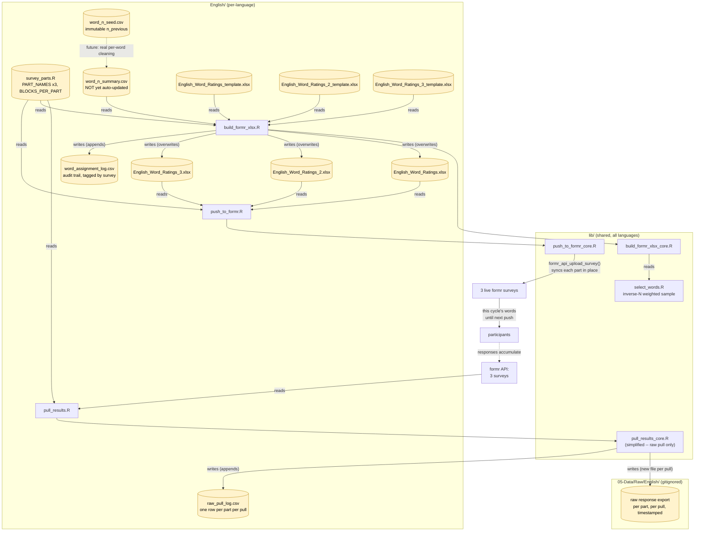

# English Task: Dynamic Word Selection Demo

Working demo of the pipeline that picks the cue words shown in the English
formr study, prioritizing undersampled cues, per the Stage 1 manuscript's
design: **30 randomly selected nouns per participant**, with undersampled
cues prioritized, cutoff at **30 responses per cue**.

Real formr identifiers, from `survey_parts.R`: run **`manyuses-english`**
(documentation only — not used in any formr API call), and **three**
survey/item-tables — `English_Word_Ratings`, `English_Word_Ratings_2`,
`English_Word_Ratings_3` — 10 word-blocks each, not one 30-block survey.

**Why three surveys, not one:** a single ~30-block survey has ~390 items
(prompt + 10 use-boxes + "more" button + submit, per word). formr's own
MySQL backend hit a row-size limit importing that ("Row size too large
(> 8126)") — formr stores one column per item, and ~390 VARCHAR columns
overflows InnoDB's row-size ceiling. Splitting into 3 surveys of 10 blocks
(~130 items each) fixed it. All 30 words for a given rebuild cycle are
still drawn together in **one** weighted sample (so prioritization stays
correct across the full set), then split evenly across the three surveys.

**This folder holds only what's genuinely English-specific** — data files
and five thin wrapper scripts. The actual pipeline logic (selection, xlsx
rebuilding, pushing to formr) is shared across every language and lives in
`../lib/`; see `../README.md` for the full shared/per-language split and
the checklist for adding another language.

**Randomization is batch-level, not per-participant, and happens
server-side at build time — not inside formr.** A formr session can't
reliably reach out and rewrite itself mid-study, so instead of embedding a
word pool and sampling live per session, the server picks all 30 words
once per rebuild and bakes them as literal text straight into the three
surveys. Every participant who takes a survey between one push and the
next sees that same word set; the next rebuild picks a fresh one. Because
the words are literal text, "which words were shown, in which survey" is
never ambiguous — it's whatever's in the xlsx (and logged in
`word_assignment_log.csv`, per survey) at that time.

**Word-count updates are simplified for now, not real yet.**
`pull_results.R` pulls each survey's raw formr results and logs the row
counts, but does **not** update `word_n_summary.csv`. Turning a raw
response row into "cue X got one more response" requires joining it
against `word_assignment_log.csv` by timestamp (since the word in any
given slot changes every rebuild cycle) — that per-word cleaning isn't
built yet. Until it is, `word_n_summary.csv` stays static and each rebuild
keeps weight-sampling from whatever it was last set to.

## Pipeline

Not called directly by cron — see `../run_all_languages.sh`, the actual
dispatcher, which runs `../lib/run_update_and_push.sh English` (and every
other active language) on a schedule, skipping any language marked `done`
in `../languages_status.csv`.

## Coverage-speed trade-off

Batch-level randomization means coverage speed = (words refreshed per
cycle) ÷ (cycle length), not driven by participant volume. At the current
defaults — 30 words total (across 3 surveys), 2-hour cycle, ~2,700-word
needs-norming pool — full coverage of the pool takes about 90 cycles,
roughly **7.5 days**, to touch every word once (let alone reach n=30 on
each). Shorten the cron interval further, or increase `BLOCKS_PER_PART` /
add more parts (in `survey_parts.R`), once real recruitment volume is
known if that's still too slow. Note this is currently moot anyway, since
`word_n_summary.csv` isn't being updated with real counts yet (see above).

## The formr survey files

Three template/live pairs, one per survey part:

- **`<Survey>_template.xlsx`** (×3) — pristine sources, 10 word-blocks each
  with placeholder hardcoded English words (never actually shown to a real
  participant — `build_formr_xlsx.R` always overwrites them). **Never
  hand-edit these or let a script overwrite them** — they're always
  regenerated fresh from `make_template.R`, which is what keeps rebuilds
  idempotent.
- **`<Survey>.xlsx`** (×3) — the generated, live files, each pushed to its
  own formr survey every cron cycle. Don't hand-edit these either, since
  the next rebuild overwrites them.

## Files in this folder

Five scripts you might edit (mostly just `survey_parts.R` and
`make_template.R`), plus data:

- `survey_parts.R` — **edit this** first for any survey-name/count change:
  `RUN_NAME`, `PART_NAMES` (the three real formr survey names), and
  `BLOCKS_PER_PART`. Sourced by all four scripts below — the single place
  these names live, so they can't drift out of sync with each other.
- `pull_results.R` — thin: reads `survey_parts.R`, calls
  `../lib/pull_results_core.R`'s `pull_results()`.
- `build_formr_xlsx.R` — thin: reads `survey_parts.R`, calls
  `../lib/build_formr_xlsx_core.R`'s `build_formr_xlsx()`.
- `push_to_formr.R` — thin: reads `survey_parts.R`, calls
  `../lib/push_to_formr_core.R`'s `push_to_formr()`.
- `make_template.R` — **edit this** only if the instructional text or
  placeholder words need to change: supplies English content (`words`,
  `instructions_label`, `prompt_fn`) to `../lib/make_template_core.R`'s
  `make_template()`, once per survey part. Not part of the regular cron
  pipeline — only re-run by hand.
- `word_n_seed.csv` — immutable baseline: each cue's `n_previous` from
  Maxwell et al. (2024) / Pexman et al. (2019) BOI, as in
  `01-Stimuli/English/English_Combined_4000.csv`. Not yet wired into
  `pull_results.R` (see above) — currently only read directly by
  `word_n_summary.csv`'s initial seeding.
- `word_n_summary.csv` — the live, committed summary (`cue`, `n_total`,
  `needs_norming`) that `build_formr_xlsx.R` samples from. Currently
  seeded 1:1 from `word_n_seed.csv` and **not auto-updated** by
  `pull_results.R` yet (see above).
- `raw_pull_log.csv` — one row per survey part per `pull_results.R` run:
  timestamp, survey name, row count, and which raw file it saved. Small
  and non-identifying (no response content), so this one is committed to
  Git, unlike the raw exports themselves.
- `word_assignment_log.csv` — audit trail: every rebuild's timestamp,
  which survey and slot the word landed in, and its `n_total` at selection
  time. Answers "what did participants see, where, and when" without
  needing to diff xlsx history. Appended to by `build_formr_xlsx.R`.

Raw formr response exports land in `05-Data/Raw/English/` (gitignored —
may contain identifying data), one timestamped file per part per pull, not
in this folder.

## What's demo-quality vs. verified

- Selection logic (`../lib/select_words.R`) is real and tested: inverse-N
  weighted sampling across all 30 words together, then split evenly across
  survey parts, matching the manuscript's "randomly selected... undersampled
  cues prioritized" language.
- `build_formr_xlsx.R` / `../lib/build_formr_xlsx_core.R` tested end-to-end
  against this folder's three template/live pairs: verified idempotent
  (repeated rebuilds always produce three 132-row files, each with a fresh
  random 10-word draw), verified word substitution lands in the right
  blocks of the right survey, verified `word_assignment_log.csv`
  accumulates correctly across rebuilds with the right survey tagged per
  row.
- `push_to_formr.R` / `formr_api_upload_survey()` syncing an existing
  study in place — confirmed (this is also what led to discovering the
  row-size limit and the resulting 3-way split).
- `../lib/run_update_and_push.sh English` tested end-to-end: each of the
  three R steps is best-effort (a failure in one doesn't skip the others),
  and the commit+push step always runs afterward regardless of which
  step(s) failed — since this repo lives on the server, a log update that
  only exists in the server's local working copy and never gets pushed is
  as good as lost. Verified locally up to that point (fails at the
  expected point: no `formr` package/credentials in this environment);
  the script still exits non-zero overall if anything failed, which
  `../run_all_languages.sh`'s per-language error handling catches.
- **Not yet verified against a live formr account:** whether each of the
  three `English_Word_Ratings*` surveys' `formr_raw_results()` calls
  return what this pipeline expects. Test this first, once real
  credentials are in `../.env`.
- **Not built yet:** the real per-word cleaning that would let
  `word_n_summary.csv` update automatically (joining raw pulls against
  `word_assignment_log.csv` by timestamp). Until then, treat this whole
  pipeline as producing three real, live surveys with a *static*
  word-priority list, not yet a self-updating one.

## TODO before this is fully live

1. Confirm all three `English_Word_Ratings*` surveys import into formr
   without the row-size error (10 blocks/~130 items each should be well
   under the limit that ~390 items hit) and that
   `formr_raw_results(survey_name = ...)` returns the expected shape for
   each — this is the first real formr credentials test.
2. Copy `../.env.example` to `../.env` and fill in real `FORMR_EMAIL` /
   `FORMR_PASSWORD` (shared across all languages — never commit `.env`),
   and make sure the server has push access to this repo (SSH key or
   credential helper).
3. Install the cron entry from the comment at the top of
   `../run_all_languages.sh` (point cron at that, not at anything in
   `../lib/` or this folder directly).
4. Build the real per-word cleaning step (join `05-Data/Raw/English/`'s
   raw pulls against `word_assignment_log.csv` by timestamp) so
   `word_n_summary.csv` starts reflecting real response counts instead of
   staying static.
5. Once real recruitment volume is known, revisit the coverage-speed
   trade-off above and shorten the cron interval / adjust
   `BLOCKS_PER_PART` if 7.5 days per full pool pass is too slow.
6. Add the next language following `../README.md`'s "Adding a new
   language" checklist, and add a row for it in `../languages_status.csv`.
   Set a language's status to `done` there once its data collection is
   complete, rather than removing its row or folder.
