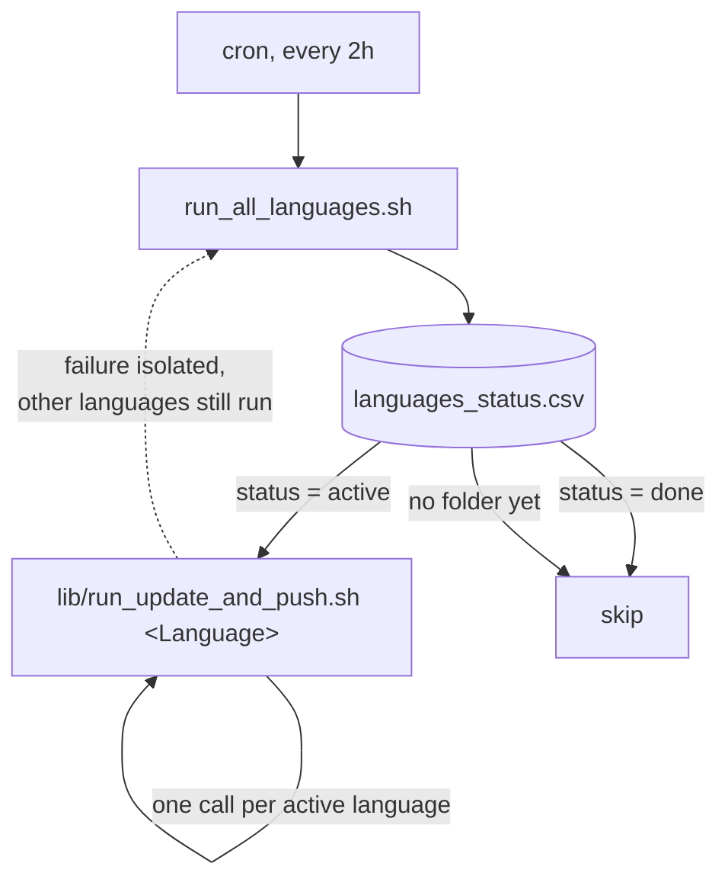

# 02-Task

One subfolder per language's formr study/studies (currently just
`English/`). Shared pipeline logic — word selection, xlsx rebuilding,
pushing to formr — lives in `lib/` as functions; each language has a small
set of thin wrapper scripts that supply its own config (survey names,
translated content) and call those functions. Nothing gets copy-pasted
per language.

**A "language" may be more than one formr survey.** formr's own MySQL
backend has a row-size limit that a single ~30-word-block survey (~390
items) exceeds on import ("Row size too large (> 8126)") — formr stores
one column per item, and that many VARCHAR columns overflows InnoDB's
row-size ceiling. So each language's 30 words are split across multiple
formr surveys ("parts"), 10 words/survey by default. English currently has
3: `English_Word_Ratings`, `English_Word_Ratings_2`,
`English_Word_Ratings_3`. See `lib/build_formr_xlsx_core.R`'s header for
the full explanation.

```
02-Task/
  languages_status.csv     which languages are active/done
  run_all_languages.sh     the cron entry point
  .env.example             template for formr credentials; copy to .env (gitignored)
  lib/                     shared logic -- never copy these into a language folder
    select_words.R           inverse-N weighted sampling, 500-word overlap set filled first
    priority_words.R         loads a language's cue words from the 500-word overlap set
    build_formr_xlsx_core.R  rebuilds one xlsx per survey part from a template + summary
    push_to_formr_core.R     syncs each part's rebuilt xlsx to its live formr study
    pull_results_core.R      pulls raw results per survey part (simplified, see below)
    make_template_core.R     generic xlsx-structure builder
    run_update_and_push.sh   per-language cron worker, takes a language name as $1
  English/                  per-language: data + five thin wrapper/config files
    survey_parts.R            <- single source of truth for this language's survey names
    pull_results.R            <- calls pull_results_core.R with survey_parts.R's names
    build_formr_xlsx.R        <- calls build_formr_xlsx_core.R with survey_parts.R's names
    push_to_formr.R           <- calls push_to_formr_core.R with survey_parts.R's names
    make_template.R           <- translated instructions/words, calls make_template_core.R
    word_n_seed.csv, word_n_summary.csv, word_assignment_log.csv, raw_pull_log.csv,
    <Survey>.xlsx / <Survey>_template.xlsx (one pair per survey part)
```

- `languages_status.csv` — `language,status` rows; `active` or `done`.
- `run_all_languages.sh` — point cron at this, not at anything inside
  `lib/` or a language folder directly. Loops the manifest, runs
  `lib/run_update_and_push.sh <Language>` for each `active` row, skips
  `done` rows and any language with no folder yet.
- `.env.example` — copy to `.env` and fill in `FORMR_CLIENT_ID` /
  `FORMR_CLIENT_SECRET` (OAuth2 API credentials, used by both
  `pull_results.R` and `push_to_formr.R` — create these at
  `admin/account#api` on your formr instance, shared across every
  language, not per-language).
  `lib/run_update_and_push.sh` sources `.env` automatically if present.
  `.env` itself is gitignored — never commit it.

**Word-count updates are currently simplified, not real yet:**
`pull_results.R` pulls each survey part's raw formr results into
`05-Data/Raw/<Language>/` (gitignored — may contain identifying data) and
logs row counts to `raw_pull_log.csv`, but does **not** update
`word_n_summary.csv`. Matching each response row to which word it actually
answered requires joining formr's raw rows against `word_assignment_log.csv`
by timestamp (since batch-level randomization means the word in any given
slot changes every rebuild cycle) — that join, plus non-answer filtering,
spellcheck, and lemmatization, now exists as `05-Data/Code/process_responses.R`
(see `05-Data/README.md`), but nothing yet feeds its output back into
updating `word_n_summary.csv`'s `n_total`. Until that wiring exists,
`word_n_summary.csv` stays static and each rebuild keeps weight-sampling
from whatever it was last set to.

## Dispatcher workflow



See each language's own README (e.g. `English/README.md`) for what
`run_update_and_push.sh` does inside a single language, including how its
words get split across multiple formr survey parts.

## Adding a new language — checklist

1. `mkdir 02-Task/<Language>`.
2. Add `<Language>/word_n_seed.csv` — that language's immutable
   `cue,n_previous` baseline (same shape as `English/word_n_seed.csv`).
3. Add `<Language>/survey_parts.R` — copy `English/survey_parts.R`, set
   `RUN_NAME` (documentation only) and `PART_NAMES` to that language's real
   formr survey names (must exactly match what you create in formr — formr
   derives the survey name from the uploaded file's name), and
   `BLOCKS_PER_PART` if not 10. This one file is what
   `pull_results.R`/`build_formr_xlsx.R`/`push_to_formr.R`/`make_template.R`
   all read, so there's only one place survey names can drift.
4. Add `<Language>/make_template.R`, `pull_results.R`,
   `build_formr_xlsx.R`, `push_to_formr.R` — copy each from `English/`
   unchanged except: `make_template.R` needs **translated content**
   (`words`, `instructions_label`, `prompt_fn`'s wording — the block
   *structure* needs no changes). The other three need no changes beyond
   what `survey_parts.R` already supplies. Run `make_template.R` once to
   produce each part's `_template.xlsx`.
5. Add a row to `languages_status.csv`: `<Language>,active`.
6. Make sure `02-Task/.env` exists with `FORMR_CLIENT_ID` /
   `FORMR_CLIENT_SECRET` set (shared across all languages — see
   `.env.example` — nothing extra needed per language here).
7. **Do not** copy anything from `lib/` into the new language folder — if
   a language ever needs genuinely different selection/build/push logic
   (not just different survey names/words), that's a sign `lib/`'s
   functions need a new parameter, not a per-language fork.

Mark a language `done` in `languages_status.csv` (don't delete its row or
folder) once its data collection is complete.
