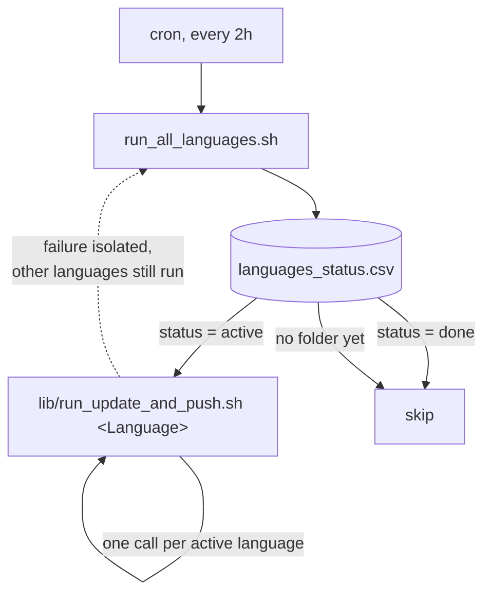

# 02-Task

One subfolder per language's formr study (currently just `English/`). All
the actual pipeline logic — word selection, xlsx rebuilding, pushing to
formr, the per-language cron worker — is shared and lives in `lib/`, not
duplicated per language. Each language folder holds only what's genuinely
language-specific: its data files and two thin config/content files.

```
02-Task/
  languages_status.csv     which languages are active/done
  run_all_languages.sh     the cron entry point
  lib/                     shared logic -- never copy these into a language folder
    select_words.R           inverse-N weighted sampling
    build_formr_xlsx.R       rebuilds word_ratings.xlsx from a template + summary
    push_to_formr.R          syncs the rebuilt xlsx to the live formr study
    update_summary_core.R    generic formr-results recompute logic
    make_template_core.R     generic xlsx-structure builder
    run_update_and_push.sh   per-language cron worker, takes a language name as $1
  English/                  per-language: data + two thin wrapper files
    update_summary.R          <- STUDY_NAME/RESULTS_TABLE only, calls update_summary_core.R
    make_template.R           <- translated instructions/words only, calls make_template_core.R
    word_n_seed.csv, word_n_summary.csv, word_assignment_log.csv,
    word_ratings.xlsx, word_ratings_template.xlsx
```

- `languages_status.csv` — `language,status` rows; `active` or `done`.
- `run_all_languages.sh` — point cron at this, not at anything inside
  `lib/` or a language folder directly. Loops the manifest, runs
  `lib/run_update_and_push.sh <Language>` for each `active` row, skips
  `done` rows and any language with no folder yet.

## Dispatcher workflow



See each language's own README (e.g. `English/README.md`) for what
`run_update_and_push.sh` does inside a single language.

## Adding a new language — checklist

1. `mkdir 02-Task/<Language>`.
2. Add `<Language>/word_n_seed.csv` — that language's immutable
   `cue,n_previous` baseline (same shape as `English/word_n_seed.csv`).
3. Add `<Language>/make_template.R` — copy `English/make_template.R` as a
   starting point, but **translate its content**: `words` (that language's
   30 placeholder words), `instructions_label`, and `prompt_fn`'s wording.
   The block *structure* it builds comes from `lib/make_template_core.R`
   and needs no changes. Run it once to produce
   `<Language>/word_ratings_template.xlsx`.
4. Add `<Language>/update_summary.R` — copy `English/update_summary.R`,
   change `STUDY_NAME` / `RESULTS_TABLE` to that language's real formr
   study. No other changes needed.
5. Add a row to `languages_status.csv`: `<Language>,active`.
6. Set `FORMR_EMAIL` / `FORMR_PASSWORD` on the server if not already set
   (shared across all languages, not per-language).
7. **Do not** copy anything from `lib/` into the new language folder — if
   a language ever needs genuinely different selection/build/push logic
   (not just different words/study name), that's a sign `lib/`'s functions
   need a new parameter, not a per-language fork.

Mark a language `done` in `languages_status.csv` (don't delete its row or
folder) once its data collection is complete.
